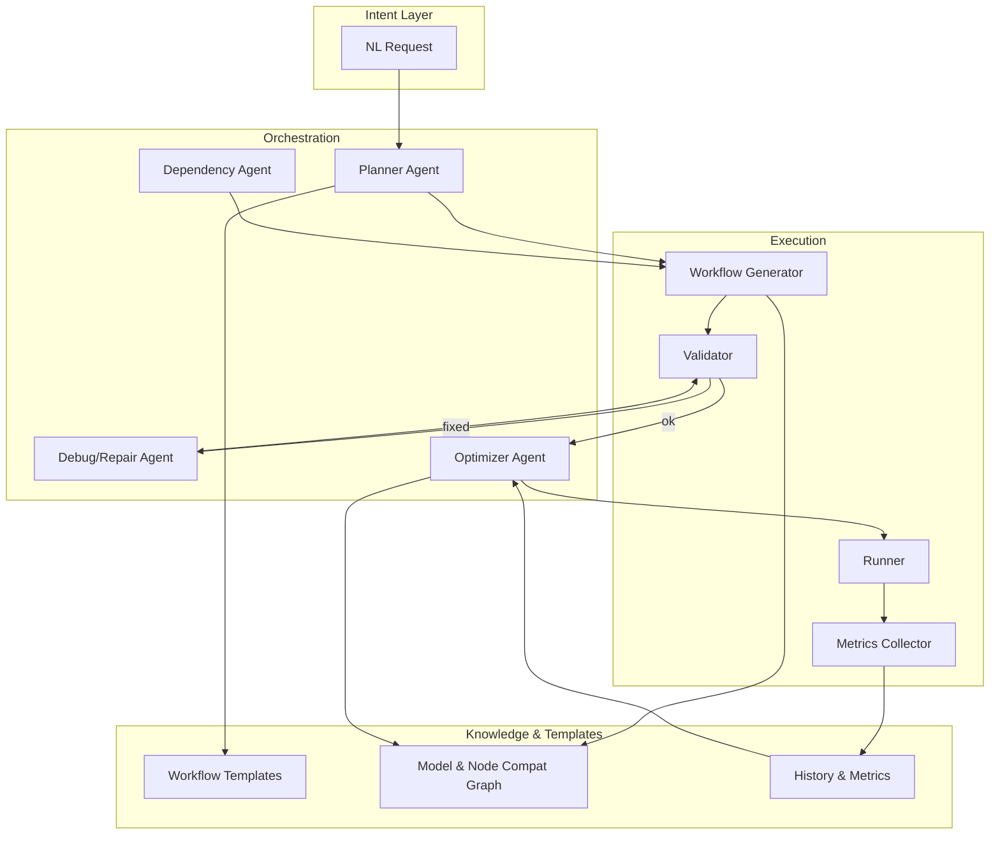
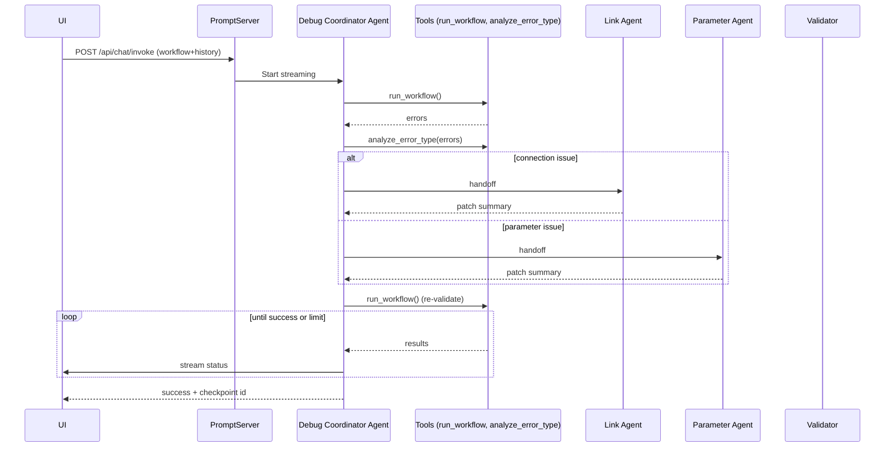

# Automated ComfyUI Workflow Generation & Optimization — Repository Evaluation and Build Plan

## Executive Summary

- Goal: An AI system that turns natural language goals into working ComfyUI workflows, fixes/optimizes them, and manages dependencies automatically.
- Finding: AIDC-AI/ComfyUI-Copilot already implements large portions of this vision: workflow generation (v1st-pass), multi‑agent debugging, rewriting, dependency discovery and download, and LLM orchestration. It is a strong foundation to extend rather than rebuild.
- Recommendation: Extend ComfyUI-Copilot with systematic parameter optimization, A/B testing, hardware-aware tuning, model-compatibility reasoning, and stronger “text → workflow” for new model families. Leverage the existing agent + tool architecture and APIs.

---

## Capability Matrix

| Capability | Desired | Status in ComfyUI‑Copilot | Notes / Pointers |
|---|---|---|---|
| Workflow generation from text | Yes | Partial, shipped in v2.0 as “Generate First Version Workflow” | `README.md` (Core Features); orchestration via `backend/agent_factory.py` and MCP `backend/service/mcp_client.py` |
| Workflow parsing/analysis | Yes | Yes | Workflow save/checkpoint: `backend/dao/workflow_table.py`; analysis and agents in `backend/service/` |
| Intelligent optimization (parameters, samplers) | Yes | Partial | Parameter tools exist: `backend/service/parameter_tools.py`; no full auto-search yet |
| Fix broken workflows | Yes | Yes (multi-agent debugging) | `backend/service/debug_agent.py` with Link Agent + Parameter Agent + Structural Agent; API in `backend/controller/conversation_api.py` |
| Dependency management (download, suggest alternatives) | Yes (current focus) | Yes | ModelScope integration: `backend/utils/modelscope_gateway.py`; model suggest/search endpoints in `backend/controller/conversation_api.py`; download progress API present |
| Workflow editing (programmatic add/remove/modify) | Yes | Yes | Update/transform tools in `backend/service/workflow_rewrite_tools.py` and rewriting agents |
| Convert workflow versions (e.g., WAN 2.2 → 2.5) | Yes | Partial/Manual | Rewriter tooling exists; add targeted transformers/templates per family |
| Programmatic APIs | Yes | Yes | ComfyUI PromptServer routes in `backend/controller/*`, tools callable via agents |
| Hardware-aware tuning (VRAM/speed) | Yes | Gap | Needs inference of device constraints and parameter search with constraints |
| Learning from results | Yes | Gap | Add metrics, history, and bandit/Bayesian strategies |

---

## Current Architecture (Observed)

```mermaid
flowchart LR
  U[User prompt / intent] --> F[Frontend UI]
  F --> PS[ComfyUI PromptServer routes]
  PS -->|invoke_chat| MCP[MCP Client / Orchestrator]
  MCP --> AG[LLM Agent (openai‑agents)]
  AG -->|tools| T1(run_workflow)
  AG -->|tools| T2(analyze_error_type)
  AG -->|tools| T3(save_current_workflow)
  T1 --> CG[Comfy Gateway → validate/run]
  subgraph Multi‑Agent Debug
    AG --> LA[Link Agent]
    AG --> PA[Parameter Agent]
    AG --> SA[Structural Agent]
    LA & PA & SA --> AG
  end
  PS --> DM[Dependency Manager]
  DM --> MS[ModelScope API]
  PS --> CKPT[Workflow Checkpoint DB]
  CKPT --> PS
```

Key components and evidence:
- LLM orchestration: `backend/agent_factory.py` uses `openai‑agents` with `AsyncOpenAI`, supports custom base URLs (OpenAI, Claude-compatible, LMStudio).
- Agents and tools: `backend/service/debug_agent.py`, `workflow_rewrite_tools.py`, `link_agent_tools.py`, `parameter_tools.py`.
- Model discovery and download: `backend/utils/modelscope_gateway.py`; endpoints `GET /api/model-searchs`, `POST /api/start-download` et al. in `backend/controller/conversation_api.py` with progress tracking.
- Streaming chat and context: `backend/controller/conversation_api.py` streams `ChatResponse` and persists checkpoints.

---

## Gaps vs. Desired System

| Area | Gap | Suggested Direction |
|---|---|---|
| Systematic parameter optimization | No integrated search/A/B/BO | Add grid/random → Hyperband/ASHA → Bayesian (Ax/BoTorch or scikit‑opt) with pluggable metrics |
| Hardware-aware objectives | Limited | Detect VRAM/throughput; derive constraints; search within feasible subspace; fallback schedulers and tiling |
| Quality metrics and learning | Lacking | Compute CLIP/LAION aesthetic/PickScore; log runs; apply bandits or BO using prior runs |
| Text → workflow for new models (e.g., WAN 2.2/2.5) | Partial & brittle | Introduce versioned templates + schema validators; retrieval over curated workflow library |
| Version conversion (e.g., WAN 2.2 → 2.5) | No dedicated transforms | Add per‑family migration rules and node maps in rewrite tools |
| Model compatibility reasoning | Basic name search | Encode capability graph (dtype/resolution/sampler compat) + automatic subgraph substitution |
| Safety & rollback | Checkpoints exist | Add “atomic patch” previews and diff review before apply; enforce checkpoint on every edit |

---

## Proposed End‑State Architecture



Design notes:
- Keep agents thin; put truth in deterministic tools (validators, transformers, metrics, compat graph).
- All changes go through checkpointing and diff preview to allow rollback.

---

## Parameter Optimization Plan

1) Objectives and metrics
- Quality: aesthetic score, CLIP score, FID‑like proxies (single‑image), user rank feedback.
- Performance: latency, VRAM peak, throughput.
- Multi‑objective: weighted utility or Pareto front; allow “optimize for speed/VRAM/quality”.

2) Search strategy
- Stage 1: Latin hypercube / random + pruning (top‑k).
- Stage 2: Hyperband/ASHA for budgets (steps, time, samples).
- Stage 3: Bayesian optimization (Gaussian Process/Tree Parzen via Ax/BoTorch or Optuna) over promising region.

3) Scope and priors
- Tunables: CFG, steps, sampler, scheduler, denoise strength, resolution/tiling, guidance types.
- Priors by model family (SD1.5, SDXL, Flux, WAN): seed recommended ranges and constraints.

4) Implementation hooks in Copilot
- Runner/validator: extend `run_workflow()` pipeline for batch execution under varying params.
- Parameter API: build on `backend/service/parameter_tools.py` to patch nodes deterministically.
- Metrics: new module to score outputs; persist in DB next to checkpoints.
- UX: add “Optimize for …” action; stream live leaderboard; support early stop.

---

## Dependency Management Enhancements

- Source multiplexing: ModelScope + Hugging Face + CivitAI, with per‑source trust/quality tags.
- Alternatives: if exact model missing, propose compatible equivalents (same type/precision/resolution); encode in the compat graph.
- Policy: cache sizes, checksum verification, resumable downloads, and rate‑limit backoff.
- UX: batch plan with sizes and ETA; user approves before download; background progress (already present) persists across sessions.

---

## Programmatic Workflow Layer

- Deterministic builders and transformers that map templates + deltas into ComfyUI JSON.
- Library of typed transformers: swap checkpoint, insert ControlNet, change scheduler, convert base model family.
- JSON schema validation and canonicalization to keep diffs stable.

Suggested modules to extend:
- `backend/service/workflow_rewrite_tools.py` — add typed patch ops (add_node, connect, replace_node, rename_param) with validation.
- `backend/service/link_agent_tools.py` — expose batched connection planning using connection confidence and type checking.

---

## Research Landscape (snapshot)

- ComfyUI‑Copilot (this repo) — mature multi‑agent assist for generation/debug/download; strongest base to extend.
- comfyui‑workflow‑generator — code‑gen for workflow APIs from `object_info.json` (structure tooling).
- comfyui‑agent — agent integrations for ComfyUI (LLM‑driven assist). Useful patterns for agent↔tool contracts.

These projects indicate growing patterns for agentic workflow generation; however, Copilot is the only one here with end‑to‑end UI + debugging + downloads integrated.

---

## Build vs Extend Decision

- Extend Copilot. Rationale:
  - Existing agents, tools, endpoints, and UI reduce risk and time.
  - Dependency manager, checkpoints, and streaming UX already solved.
  - Clear extension points for optimization and templates.

Risks and mitigations:
- LLM brittleness on new model families → versioned templates + validators + RAG over curated workflows.
- Cost/latency of optimization → ASHA + surrogate metrics + small batch evaluation.
- Regressions in workflow edits → atomic patches, schema checks, and auto‑checkpointing before apply.

---

## Milestone Plan

1) Templates + Validators (2 weeks)
- Curate top workflows (WAN/AnimateDiff/SDXL/Flux); encode schema; add converters.

2) Optimization Alpha (3–4 weeks)
- Random/ASHA search; aesthetic score; leaderboard UI; checkpoint + artifact store.

3) Hardware‑Aware Tuning (2 weeks)
- Detect VRAM; enforce constraints; tiling/low‑VRAM presets.

4) Compat Graph + Alternatives (2 weeks)
- Node/model type graph; equivalent model mapping; fallback selection.

5) BO + Learning (3 weeks)
- Bayesian optimization; reuse history; user feedback loop.

---

## API Sketches (to add/extend)

- `POST /api/optimize/start` — body: objective, budget, tunables, constraints → returns run_id.
- `GET /api/optimize/progress/{run_id}` — streaming leaderboard and partial fronts.
- `POST /api/workflows/transform` — apply typed operations (add_node/connect/replace/checkpoint).
- `GET /api/models/alternatives` — input: missing model spec → output: ranked compatibles.

These align with existing `conversation_api.py` patterns and download progress APIs.

---

## Success Criteria Mapping

- Intent → working workflow: shipped (first pass) and strengthened by templates.
- Auto dependencies: ModelScope + alternatives + policy improvements.
- Optimize for goals: optimization engine with selectable objectives.
- Learn from results: metrics store + BO loop.
- Full lifecycle: create → debug → tune → fix → optimize with checkpoints and rollbacks.

---

## File Pointers (for implementers)

- LLM/agents bootstrap: `ComfyUI-Copilot/backend/agent_factory.py`
- Streaming/invoke and checkpoints: `ComfyUI-Copilot/backend/controller/conversation_api.py`
- Debug/repair agents: `ComfyUI-Copilot/backend/service/debug_agent.py`
- Rewrite tools/agents: `ComfyUI-Copilot/backend/service/workflow_rewrite_tools.py`, `workflow_rewrite_agent.py`
- Link/parameter tools: `ComfyUI-Copilot/backend/service/link_agent_tools.py`, `parameter_tools.py`
- Dependency discovery: `ComfyUI-Copilot/backend/utils/modelscope_gateway.py`

---

## Appendix: Example Flow — Debug Loop



---

## Appendix: Tunables Table (seed set)

| Parameter | Typical Range | Notes |
|---|---|---|
| Steps | 8–40 | Budgeted by ASHA; higher for quality |
| CFG | 1.5–9.0 | Model‑family priors differ |
| Sampler | Euler/DPMPP/SDE | Family‑dependent |
| Scheduler | Karras/Exponential | Family‑dependent |
| Denoise strength (img2img/video) | 0.2–0.8 | Task‑dependent |
| Resolution | presets (e.g., 1024/1536) | Tiled for low VRAM |

