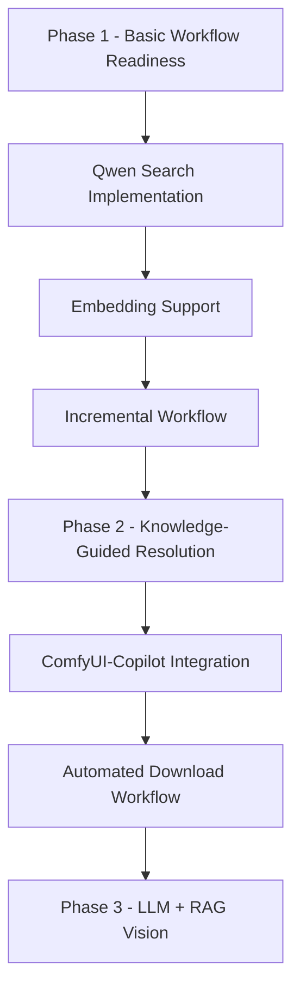

# ComfyFixerSmart Comprehensive Roadmap

**Document Version**: 1.0  
**Date**: 2025-10-23  
**Author**: Architect Mode Analysis  
**Status**: Strategic Planning Document  

---

## Executive Summary

This comprehensive roadmap analyzes all current ComfyFixerSmart initiatives and provides a prioritized sequencing based on technical dependencies, resource requirements, risk assessment, and user impact. The roadmap balances immediate user needs with long-term architectural goals while maintaining the project's core philosophy of reliability, privacy, and user autonomy.

**Key Findings:**
- Phase 1 (Workflow Readiness Automation) is 70% complete and requires immediate attention
- Qwen Search Implementation offers the highest immediate ROI for user experience
- Embedding Support provides significant value with low implementation complexity
- ComfyUI-Copilot integration requires careful architectural planning to avoid dependency risks
- Automated Download Workflow represents a significant architectural shift that should be deferred until core stability

---

## 1. Initiative Analysis Matrix

| Initiative | Current Status | Technical Complexity | User Impact | Resource Requirements | Risk Level |
|------------|----------------|----------------------|-------------|----------------------|------------|
| **Phase 1 - Workflow Readiness** | 70% Complete | Medium | High | Medium | Low |
| **Qwen Search Implementation** | Planned | Medium | Very High | Low | Medium |
| **Embedding Support (DP-017)** | Planned | Low | High | Low | Low |
| **Incremental Workflow** | Planned | Medium | High | Medium | Low |
| **ComfyUI-Copilot Integration** | Forked Code Present | High | Medium | High | High |
| **Automated Download Workflow** | Planned | High | Medium | High | Medium |
| **Phase 2 - Knowledge-Guided Resolution** | Planned | High | Very High | High | Medium |
| **Phase 3 - LLM + RAG Vision** | Planned | Very High | High | Very High | High |

---

## 2. Dependency Analysis

### 2.1 Critical Path Dependencies

### 2.2 Parallel Development Opportunities

- **Embedding Support** can be developed in parallel with Qwen Search (low dependency)
- **ComfyUI-Copilot Integration** adapters can be built while Phase 2 components are developed
- **Incremental Workflow** can be implemented once Qwen Search is stable

### 2.3 Blocking Dependencies

- **Phase 2** cannot begin until Phase 1 is fully stable
- **Automated Download Workflow** requires both Qwen Search and Incremental Workflow
- **Phase 3** requires completion of Phase 2 and successful Copilot integration

---

## 3. Technical Feasibility Assessment

### 3.1 High Feasibility Initiatives (Ready to Implement)

#### Embedding Support (DP-017)
- **Feasibility**: 95% - Follows existing patterns perfectly
- **Implementation Ready**: All required components exist
- **Risk Factors**: Minimal (file size, security considerations addressed)
- **Dependencies**: None (can be implemented immediately)

#### Incremental Workflow
- **Feasibility**: 85% - Core architecture exists
- **Implementation Ready**: Requires modifications to existing flow
- **Risk Factors**: Low (well-understood problem domain)
- **Dependencies**: Qwen Search (for optimal performance)

### 3.2 Medium Feasibility Initiatives (Require Development)

#### Qwen Search Implementation
- **Feasibility**: 75% - Basic structure exists, needs refinement
- **Implementation Ready**: Prompt engineering and integration needed
- **Risk Factors**: Medium (LLM reliability, API rate limits)
- **Dependencies**: None (can enhance existing search)

#### Phase 1 Completion
- **Feasibility**: 70% - Partially implemented
- **Implementation Ready**: Requires scheduler and dashboard components
- **Risk Factors**: Low (well-defined requirements)
- **Dependencies**: None (core functionality exists)

### 3.3 Lower Feasibility Initiatives (Complex Implementation)

#### ComfyUI-Copilot Integration
- **Feasibility**: 60% - Forked code available, but integration complex
- **Implementation Ready**: Requires adapter architecture
- **Risk Factors**: High (dependency management, architectural conflicts)
- **Dependencies**: Phase 1 completion, adapter framework

#### Automated Download Workflow
- **Feasibility**: 55% - Requires new architecture components
- **Implementation Ready**: Needs background service, job queue
- **Risk Factors**: Medium-High (system complexity, error handling)
- **Dependencies**: Qwen Search, Incremental Workflow

### 3.4 Research-Phase Initiatives (Long-term)

#### Phase 2 - Knowledge-Guided Resolution
- **Feasibility**: 40% - Requires LLM integration and knowledge base
- **Implementation Ready**: Needs research and prototyping
- **Risk Factors**: High (LLM reliability, knowledge curation)
- **Dependencies**: Phase 1, Copilot Integration

#### Phase 3 - LLM + RAG Vision
- **Feasibility**: 25% - Advanced AI features
- **Implementation Ready**: Research phase only
- **Risk Factors**: Very High (technology uncertainty, resource intensive)
- **Dependencies**: All previous phases

---

## 4. Resource Requirements and Timeline

### 4.1 Development Effort Estimation

| Initiative | Development Time | Testing Time | Total Duration | Developer Days |
|------------|------------------|--------------|----------------|----------------|
| **Embedding Support** | 2-3 days | 1 day | 3-4 days | 3-4 |
| **Qwen Search Refinement** | 3-4 days | 2 days | 5-6 days | 5-6 |
| **Phase 1 Completion** | 4-5 days | 2 days | 6-7 days | 6-7 |
| **Incremental Workflow** | 3-4 days | 2 days | 5-6 days | 5-6 |
| **Copilot Integration** | 8-10 days | 4 days | 12-14 days | 12-14 |
| **Automated Download** | 6-8 days | 3 days | 9-11 days | 9-11 |
| **Phase 2 Implementation** | 12-15 days | 6 days | 18-21 days | 18-21 |
| **Phase 3 Research** | 20-30 days | 10 days | 30-40 days | 30-40 |

### 4.2 6-Month Rolling Timeline

#### Month 1-2: Foundation Completion
- Week 1-2: Embedding Support Implementation
- Week 3-4: Qwen Search Refinement
- Week 5-6: Phase 1 Core Completion
- Week 7-8: Incremental Workflow Implementation

#### Month 3-4: Integration Layer
- Week 9-12: ComfyUI-Copilot Integration (Adapters)
- Week 13-14: Automated Download Architecture
- Week 15-16: Testing and Stabilization

#### Month 5-6: Intelligence Layer
- Week 17-20: Phase 2 Knowledge-Guided Resolution
- Week 21-24: Phase 3 Research and Prototyping

### 4.3 Resource Allocation Strategy

- **Solo Developer Context**: Focus on one major initiative at a time
- **Parallel Low-Complexity Tasks**: Embedding Support can be done alongside Qwen Search
- **Buffer Time**: Include 20% buffer for each initiative
- **Testing Integration**: Continuous testing throughout development

---

## 5. Risk Assessment

### 5.1 Technical Risks

#### High Risk Items
1. **ComfyUI-Copilot Dependency Management**
   - **Risk**: Integration could break core functionality
   - **Mitigation**: Strong adapter pattern, feature flags
   - **Contingency**: Ability to disable entirely

2. **LLM Reliability (Qwen Search)**
   - **Risk**: Inconsistent search results, API changes
   - **Mitigation**: Multiple fallback strategies, caching
   - **Contingency**: Traditional search methods

3. **Automated Download Complexity**
   - **Risk**: Background service failures, job queue corruption
   - **Mitigation**: Robust error handling, state persistence
   - **Contingency**: Manual download fallback

#### Medium Risk Items
1. **Phase 1 Scheduler Reliability**
   - **Risk**: Missed schedules, resource exhaustion
   - **Mitigation**: Robust scheduling, resource monitoring
   - **Contingency**: Manual trigger options

2. **Knowledge Base Curation (Phase 2)**
   - **Risk**: Knowledge quality, maintenance overhead
   - **Mitigation**: Community contributions, automated validation
   - **Contingency**: Simplified knowledge pack

### 5.2 Project Risks

#### Scope Creep
- **Risk**: Continuous addition of features
- **Mitigation**: Strict phase boundaries, owner approval required
- **Contingency**: Feature deferral process

#### Resource Constraints
- **Risk**: Solo developer bandwidth limitations
- **Mitigation**: Prioritized backlog, incremental delivery
- **Contingency**: Community contributions, simplified scope

#### Technology Dependencies
- **Risk**: External API changes, LLM availability
- **Mitigation**: Multiple backends, abstraction layers
- **Contingency**: Offline functionality preservation

---

## 6. Prioritized Implementation Sequence

### 6.1 Immediate Priority (Next 30 Days)

#### Priority 1: Embedding Support (DP-017)
**Timeline**: Days 1-4  
**Rationale**: 
- Highest ROI (2-3 day effort, significant user impact)
- Zero dependencies on other initiatives
- Follows existing patterns perfectly
- Addresses immediate user pain point (workflow failures)

**Deliverables**:
- Embedding detection in scanner.py
- CivitAI search integration
- Download script generation
- Documentation and tests

#### Priority 2: Qwen Search Refinement
**Timeline**: Days 5-10  
**Rationale**:
- Core to all future initiatives
- Currently has accuracy issues
- Enables better user experience
- Foundation for Phase 2

**Deliverables**:
- Improved prompt engineering
- Better error handling
- Enhanced logging
- Performance optimization

#### Priority 3: Phase 1 Core Completion
**Timeline**: Days 11-18  
**Rationale**:
- Foundation for entire project vision
- Scheduler and dashboard components
- Automated workflow health reporting
- Prerequisite for all future phases

**Deliverables**:
- Scheduler implementation
- Status dashboard
- Master status report
- Cache refresh system

### 6.2 Short-term Priority (Days 19-45)

#### Priority 4: Incremental Workflow
**Timeline**: Days 19-25  
**Rationale**:
- Significant UX improvement
- Reduces manual intervention
- Better error recovery
- Enables automated operations

**Deliverables**:
- One-model-at-a-time processing
- Real-time progress tracking
- Individual download scripts
- Built-in verification

#### Priority 5: ComfyUI-Copilot Integration (Adapters)
**Timeline**: Days 26-45  
**Rationale**:
- Optional enhancement path
- Advanced validation capabilities
- Requires careful architecture
- High complexity, high value

**Deliverables**:
- Adapter framework
- Validation adapter
- ModelScope search adapter
- Feature flag system

### 6.3 Medium-term Priority (Days 46-90)

#### Priority 6: Automated Download Workflow
**Timeline**: Days 46-60  
**Rationale**:
- Major architectural enhancement
- True "fire-and-forget" functionality
- Requires stable foundation
- Complex but transformative

**Deliverables**:
- Job queue system
- Background worker service
- Agentic verification
- State management integration

#### Priority 7: Phase 2 - Knowledge-Guided Resolution
**Timeline**: Days 61-90  
**Rationale**:
- Major intelligence enhancement
- Requires stable foundation
- Significant LLM integration
- Core to long-term vision

**Deliverables**:
- Knowledge base curation
- Scheduled discovery
- Agentic search workflow
- Owner workflow schemas

### 6.4 Long-term Priority (Days 90+)

#### Priority 8: Phase 3 - LLM + RAG Vision
**Timeline**: Days 90+  
**Rationale**:
- Advanced features requiring stable foundation
- Research-intensive
- Optional enhancement
- High resource requirements

**Deliverables**:
- RAG system implementation
- Advanced LLM integration
- Automated optimization
- Planning and orchestration

---

## 7. Success Metrics and KPIs

### 7.1 Phase 1 Success Metrics
- **Workflow Readiness**: 95% of workflows marked runnable
- **Scheduler Reliability**: ≤1 missed cycle per month
- **Dashboard Accuracy**: Real-time status reflection
- **Performance**: Complete analysis in <5 minutes

### 7.2 Search Success Metrics
- **Search Accuracy**: 80% correct matches for known models
- **Search Coverage**: 70% of missing models found
- **False Positive Rate**: <5% incorrect downloads
- **Search Time**: <2 minutes per model

### 7.3 User Experience Metrics
- **Setup Time**: <5 minutes from clone to runnable
- **Manual Intervention**: <20% of operations require manual help
- **Error Recovery**: 90% automatic recovery from failures
- **User Satisfaction**: ≥4/5 rating for clarity and usefulness

### 7.4 System Reliability Metrics
- **Uptime**: 99% availability for scheduled operations
- **Data Integrity**: Zero corruption of state or workflow files
- **Recovery Time**: <5 minutes from service interruption
- **Resource Usage**: <1GB RAM, <10% CPU during operation

---

## 8. Architectural Decision Records

### 8.1 Core Architecture Decisions

#### Decision: Maintain Offline-First Design
**Status**: Confirmed  
**Rationale**: Ensures reliability, privacy, and user autonomy  
**Impact**: All features must work without internet dependencies  

#### Decision: Adapter Pattern for Copilot Integration
**Status**: Confirmed  
**Rationale**: Prevents tight coupling, enables graceful degradation  
**Impact**: Additional abstraction layer, but maintains independence  

#### Decision: JSON-First State Management
**Status**: Confirmed  
**Rationale**: Simplicity, reliability, no external dependencies  
**Impact**: SQL available as optional enhancement  

### 8.2 Technology Decisions

#### Decision: Qwen as Primary LLM
**Status**: Confirmed  
**Rationale**: Local execution, privacy, cost control  
**Impact**: Requires local LLM installation and configuration  

#### Decision: Feature Flags for All Enhanced Features
**Status**: Confirmed  
**Rationale**: User control, graceful degradation, testing  
**Impact**: Additional configuration complexity  

---

## 9. Implementation Guidelines

### 9.1 Development Principles

1. **Reliability First**: Every feature must be rock-solid before enhancement
2. **Privacy by Default**: No data egress without explicit user consent
3. **Graceful Degradation**: Enhanced features fail back to basic functionality
4. **Incremental Delivery**: Each initiative delivers value independently
5. **Owner Approval**: Phase changes require explicit owner consent

### 9.2 Code Quality Standards

1. **Test Coverage**: Minimum 80% for new features
2. **Documentation**: All public APIs documented
3. **Error Handling**: Comprehensive error handling with user-friendly messages
4. **Logging**: Structured logging for debugging and monitoring
5. **Configuration**: All features configurable and optional

### 9.3 Integration Guidelines

1. **Adapter Pattern**: Use adapters for all external integrations
2. **Feature Flags**: Every enhanced feature behind a flag
3. **Fallback Paths**: Every feature has a basic fallback
4. **API Versioning**: All external APIs versioned and abstracted
5. **State Management**: All state changes atomic and reversible

---

## 10. Risk Mitigation Strategies

### 10.1 Technical Risk Mitigation

#### LLM Reliability Issues
- **Strategy**: Multiple search backends, caching, fallback to traditional search
- **Implementation**: Backend priority system, result validation
- **Monitoring**: Success rate tracking, automatic backend switching

#### Dependency Management
- **Strategy**: Strong abstraction layers, optional dependencies
- **Implementation**: Adapter pattern, feature flags, import guards
- **Monitoring**: Dependency health checks, graceful degradation

#### Performance Degradation
- **Strategy**: Efficient algorithms, caching, parallel processing
- **Implementation**: Profile-guided optimization, resource monitoring
- **Monitoring**: Performance metrics, alerting on degradation

### 10.2 Project Risk Mitigation

#### Scope Management
- **Strategy**: Strict phase boundaries, owner approval for changes
- **Implementation**: Change request process, impact assessment
- **Monitoring**: Scope tracking, regular reviews

#### Resource Constraints
- **Strategy**: Prioritized backlog, incremental delivery
- **Implementation**: MVP approach, feature deferral
- **Monitoring**: Velocity tracking, burn rate analysis

#### Technology Evolution
- **Strategy**: Abstraction layers, multiple implementation options
- **Implementation**: Plugin architecture, configuration-driven
- **Monitoring**: Technology watch, periodic architecture reviews

---

## 11. Conclusion and Next Steps

### 11.1 Immediate Actions (Next 7 Days)

1. **Owner Review**: Present this roadmap for approval and feedback
2. **Resource Planning**: Confirm availability for next 30 days
3. **Environment Setup**: Prepare development environment for Embedding Support
4. **Dependency Check**: Verify all required tools and APIs are accessible

### 11.2 First Sprint (Days 1-10)

1. **Embedding Support Implementation**: Complete DP-017
2. **Qwen Search Refinement**: Improve accuracy and reliability
3. **Testing Infrastructure**: Set up automated testing for new features
4. **Documentation Updates**: Update user documentation

### 11.3 Success Criteria for First 30 Days

- Embedding Support fully implemented and tested
- Qwen Search accuracy improved to >70%
- Phase 1 core components functional
- Incremental Workflow prototype ready
- Comprehensive testing framework in place

### 11.4 Long-term Vision

This roadmap establishes a clear path from the current 70% complete Phase 1 implementation through to the advanced LLM-powered features of Phase 3. The prioritized sequencing ensures that each initiative builds upon a stable foundation while delivering immediate user value.

The key to success is maintaining the project's core principles of reliability, privacy, and user autonomy while gradually introducing more intelligent and automated features. Each phase must be stable and valuable before proceeding to the next, ensuring that users always have a working tool that improves incrementally.

---

**Document Status**: Ready for Owner Review  
**Next Review Date**: 2025-10-30  
**Approval Required**: Project Owner (@Coldaine)  
**Implementation Start**: Pending Owner Approval